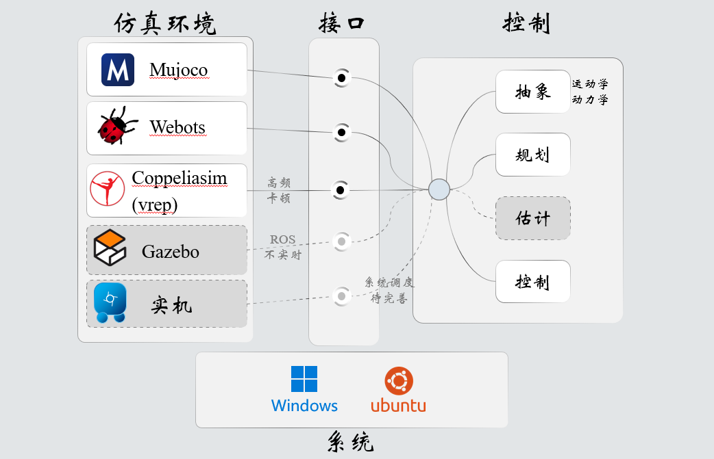
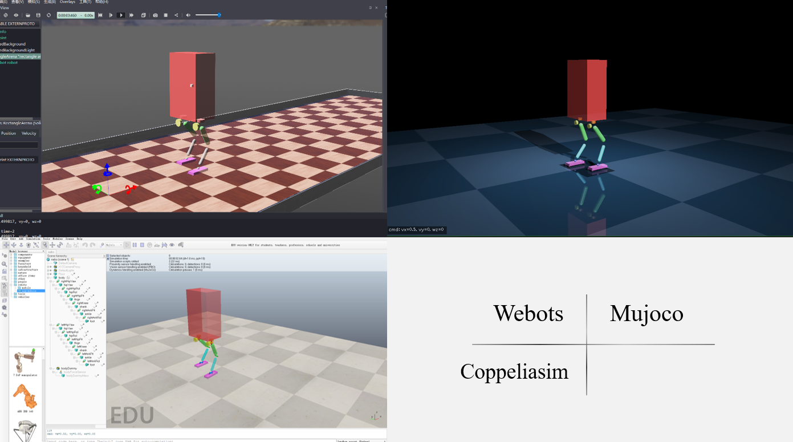

开源一个双足机器人控制框架【小炮（nabo）】

临近毕业，在人生中难得的空隙时间里，搓出一个双足机器人控制框架。项目名称“小炮”，有感于管导电影《老炮儿》，以致敬在社会变迁中无畏的性情与精神，英文名nabo（naughty boy）。目前项目尚未完全成熟，仅以成长期形态与爱好者分享，希望后期小炮能够以全新的姿态继续冲锋。

小炮的算法仍采用了质心MPC的保守策略，凭心而论，如果只是打着贡献的旗号向社区灌水确实停没劲的，而且是对广大爱好者精力的浪费。因此本项目构建上有两个特点值得一看：

# 特点一：易用性拉满

跨系统、跨环境、自集成依赖、易部署（仿真+实机）

小炮完全由c++构建，核心控制nabo_core以动态库形式发布，构建中已自集成全部依赖，无需配置任何环境（当然编译器环境不算在内）。在nabo_core之外，对接了不同接口，使之无需任何修改即可运行在win、lin系统中不同的仿真软件、甚至实机之上。小炮项目结构如下：

状态估计模块中外力估计、触地检测、坡度估计、运动状态估计尚未完成，此处平衡控制所需的运动状态直接采用了仿真中上帝视角的测量值。坡面、楼梯等复杂环境规划尚未完成。
不同的仿真平台可供开发者根据兴趣选用，其中，mujoco与webots都是c++直接仿真实时控制的，推荐使用。但coppelia有两个缺点，一是出于对网络api实时性的怀疑没有采用c++接口，而是采用内置python调用c++动态库的方式；二是coppelia默认控制周期只有20hz，设置到1khz仿真会极其缓慢，堪比matlab simscape。采用其他仿真频率需重新调参，个人没有尝试。gazebo的ros接口与实机调度接口尚未完成。

# 特点二：易读性拉满

MIT开源是载入史册的功绩，但其项目结构却稍显庞杂，以至于给入门新手造成不小的阅读压力。近来有几个基于MIT的开源双足项目，其中又缝合了一些其他项目包，都多少也继承了前者的这一特点。小炮项目完全由个人构建，一开始便把机器效率性与人类易读性考虑在内，特征如下：

1. **零飞针**

指针是c++的一大杀器，但大家普遍用这把宰牛刀来杀鸡。就如同拿着火箭炮追杀苍蝇一样，能想象到作者很爽的样子，但读者看到的却是指针乱飞硝烟四起。指针创建、初始化、移动语义、继承、强制转换、别名、调用、销毁，会给阅读造成非常大的障碍。小炮采用单例模式封装了一些必须传递的数据结构，项目内没有任何一个乱飞的指针、更没有混乱的移动语义或强制转换，并且仅系统调度模块采用了继承（系统调度尚未实现），大大降低了对读者来说的阅读障碍。

2. **严封装**

头文件是c++的又一特征，但多层级include后，头文件定义的各种类型变量就会充斥整个项目，从而被编译器反复编译，并且也会扰乱编辑器的自动补全候选。小炮的构建中，采用嵌套类的方式，彻底隔离了“文件相关但功能无关”之间的include污染，使代码更加清爽便于阅读。

3. **低层级**

c++保留了c的直白，但存在一些项目采用了过度的对象封装，有时候两三行代码一层的各种套娃，如ocs2确实是一个优秀的优化控制项目，但阅读时读者会像钻盗墓洞一样疯狂F12最后被憋死在墓坑里。小炮中，模块封装面向对象、逻辑调用面向过程，用符合物理逻辑的调用次序结构，尽量避免读者像剥洋葱一样剥着剥着就哭了。

4. **精简发布**

小炮项目不采用includ与src分离的文件隔离手段。该手段本意是为了便于编译发布，但发布版理应是库文件+几个关键头文件，为了这几个头文件就让整个项目失去构建便利性实在有些因小失大。小炮核心文件nabo_core的编译发布仅包含两个头文件，其综合代码量超不过一屏。因此项目中所有.h与.cpp放在一起，极大的方便了读者阅读查看。

# 运行截图

# 编译运行方法
